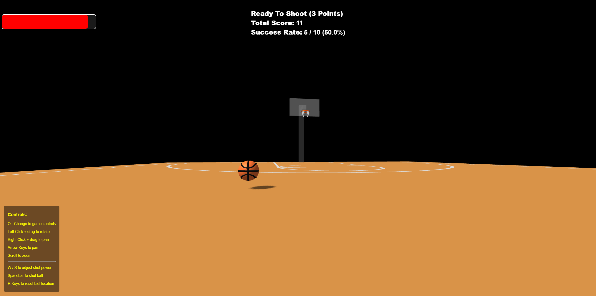
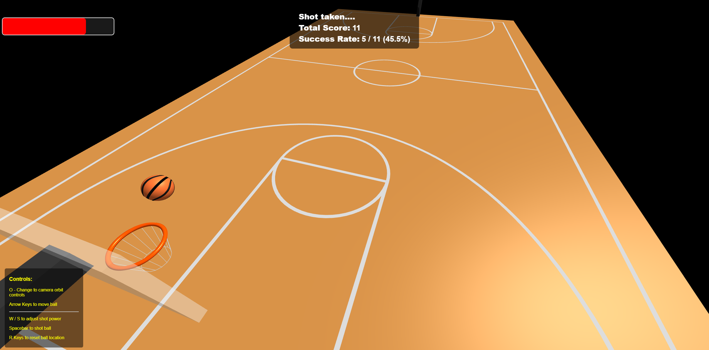
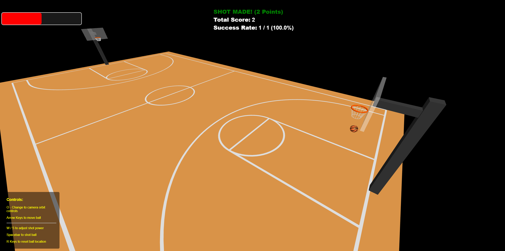

# Computer Graphics - Exercise 6 - WebGL Basketball Court

## Getting Started
1. Clone this repository to your local machine
2. Make sure you have Node.js installed
3. Start the local web server: `node index.js`
4. Open your browser and go to http://localhost:8000

## 🎮 Detailed Control Specifications

| **Control** | **Function**             | **Implementation Details** |
|-------------|--------------------------|-----------------------------|
| **Arrow Keys** | Move Basketball | • Left/Right: Move ball horizontally across court    • Up/Down: Move ball forward/backward on court    • Smooth movement with appropriate speed    • Keep ball within court boundaries |
| **W / S Keys** | Adjust Shot Power | • W: Increase shot power (stronger shot)    • S: Decrease shot power (weaker shot)    • Visual indicator showing current power level    • Power range: 0% to 100% |
| **Spacebar** | Shoot Basketball | • Launch ball toward nearest hoop    • Use current power level for initial velocity    • Calculate trajectory to reach hoop    • Apply physics simulation after launch |
| **R Key** | Reset Basketball | • Return ball to center court position    • Reset ball velocity to zero    • Reset shot power to default (50%)    • Clear any physics state |
| **O Key** | Toggle Camera | • Enable/disable orbit camera controls    |

### Basketball being moved around the court using arrow keys with shot power adjustment

### Shooting with rotation animation

### Shot with score update

### 🎥 Demo Video

## Group Members
- Guy Ben Ari 203020623
- Niv Ben Salamon 315073346

## Technical Details
- Run the server with: `node index.js`
- Access at http://localhost:8000 in your web browser
